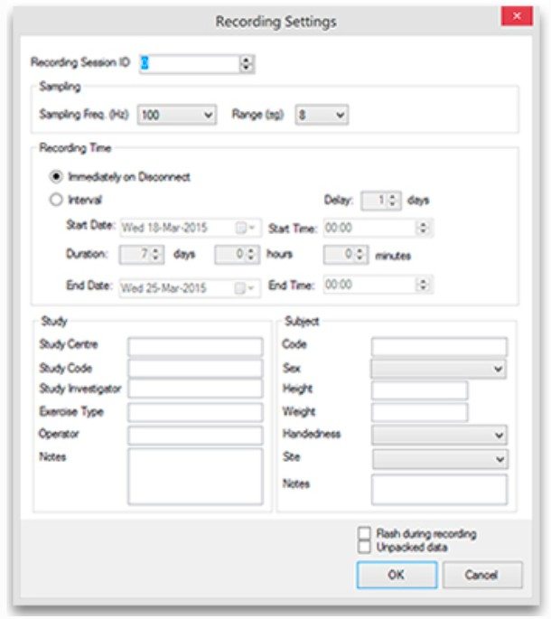
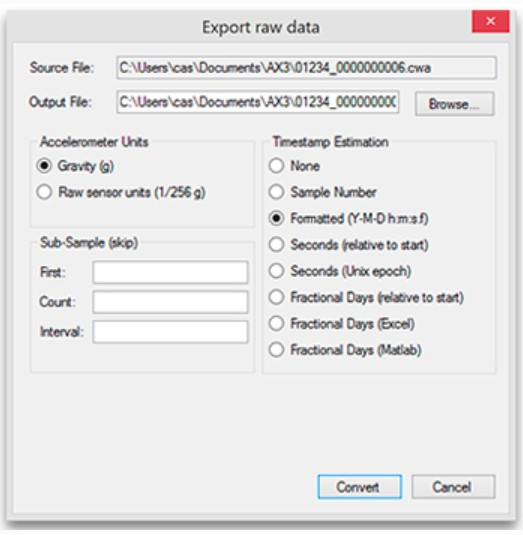


# Accelerometer-based measurement to quantify muscle fatigue

**Authors :** Mahoua KONE, Lucie Bonnot, Loubna EL FARESSI, Bomane PEHE 
**Date :** November 10, 2025  
**Supervisor :** Denis MOTTET

---

## 1. Introduction

### Muscular Fatigue and Accelerometry Analysis

Muscular fatigue is characterized by a progressive decline in a muscle’s ability to generate force, manifesting as alterations in movement execution, reduced range of motion, or decreased movement regularity. Although physiological tools such as electromyography, heart rate monitoring, or blood lactate assessment can be used to quantify fatigue, these methods are often costly, invasive, or difficult to implement in real-world conditions.

Inertial sensors, particularly accelerometers, offer a simple, portable, and non-invasive alternative for analyzing movement dynamics. By measuring acceleration along three axes, they provide a quantitative estimation of movement intensity, notably through the acceleration norm.

---

### Objective of the Study

In this project, we examined the evolution of acceleration signals during a jump-rope exercise. The goal was to determine whether the placement of the sensor influences the ability to detect muscular fatigue throughout the task. Two locations were tested within the same session:

- **Right wrist** — primarily involved in rope rotation  
- **Right ankle** — directly associated with take-off and landing phases
---

### Working Hypothesis

Our general hypothesis is that the dynamics of the acceleration signal depend on sensor location, as the wrist and ankle are subjected to different biomechanical constraints.

More specifically, we assumed that:

The ankle-mounted sensor would be more sensitive to fatigue-related changes, as it captures variations in propulsion, stability, and impact forces during jumps.

The wrist-mounted sensor would mainly reflect rope rotation, which is expected to be less affected by lower-limb muscular fatigue.

---

### Data Processing and Analysis

To test this hypothesis:

1. The acceleration signal was analyzed over the full duration of the exercise.
2. The signal was segmented into **normalized time intervals**, allowing us to observe changes in movement intensity from the beginning to the end of the session.
3. The **acceleration distributions** from both sensor locations were compared.
   
This comparison aimed to identify which placement provides the most relevant information for detecting signs of muscular fatigue during jump-rope exercise.

---

## 2. Materials and Methods

### 2.1. Materials

The study was conducted using an **Axivity AX3 tri-axial accelerometer** (Axivity Ltd., United Kingdom), an inertial device widely employed in movement science for the quantification of physical activity.

The AX3 is a standalone data logger that includes:
- a tri-axial MEMS sensor,  
- an internal clock,  
- onboard flash memory enabling continuous data recording.

It connects to a computer via USB for configuration, data transfer, and battery charging.

The sensor was configured with:
- a **sampling frequency of 100 Hz**,  
- a **measurement range of ±8 g**,  

which are suitable parameters for capturing rapid movements such as jump-rope exercise.

The devices were firmly attached to the right wrist and right ankle to minimize motion artifacts. After each exercise bout, the recordings were exported in CSV format using the OmGui software (Axivity Ltd.).

### 2.2. Experimental Protocol

### General Description

The study was conducted with a voluntary female student who presented no known locomotor disorders or functional limitations. She performed a jump-rope exercise at a self-selected intensity for a duration sufficient to induce progressive muscular fatigue.

During all trials, two Axivity AX3 accelerometers were used simultaneously: one on the right wrist and one on the right ankle. This setup allowed us to record, for the same movement and at the same instant, two acceleration signals corresponding to two distinct body segments. The goal was to compare the temporal dynamics of these signals to determine which sensor location is most relevant for detecting indicators of muscular fatigue.

---

### Experimental Conditions

| Sensor                         | Body location | Exercise   | Recording mode |
|-------------------------------|---------------|------------|----------------|
| Axivity AX3, 100 Hz sampling rate | Right wrist   | Jump rope  | Simultaneous   |
| Axivity AX3, 100 Hz sampling rate | Right ankle   | Jump rope  | Simultaneous   |

**Table 1 : Experimental Conditions**

---

### Programming and configuring the sensor:

Before each measurement, the Axivity AX3 sensor was configured using the OmGui software (Axivity Ltd.). This software allows sensors to be set up, initialized, and synchronized prior to data recording.

The configuration steps were as follows:
1. Sensor connection: The sensor is connected to the computer via a micro-USB type B cable. It automatically appears in the Device Browser Pane of the OmGui software.
2. Clearing previous data: The Clear button is used to delete any prior recordings stored in the sensor’s internal memory, ensuring a blank data file for each test.
3. Acquisition parameter settings:
    * Sampling frequency: 100 Hz
    * Measurement range: ±8 g
    * Start mode: Start at programmed time
    * Synchronization: the sensor’s internal clock is automatically adjusted to the computer’s time at validation.
4. Start time programming: The sensor was programmed to automatically begin recording at the predefined time set in the software (interval start time). Once disconnected from the computer, the device remained in standby until the scheduled time was reached, at which point recording started autonomously.

**Figure 1 – “Recording Settings” window of the OmGui software**

---

### Data Collection and Transfer:

The participant performed three series of jump-rope exercise: the first lasted 4 minutes and the following two lasted 5 minutes each.

A 5-minute rest period was provided between series. This pause allowed the experimenter to: download the recorded data, reprogram the sensors for the next trial, and provide brief muscular recovery before resuming the exercise.

At the end of each series, the accelerometers were reconnected to the computer to retrieve the data. The recording was stopped using the Stop command, then the Download function was used to transfer the file in .CWA format to the OmGui Working Folder.

The recordings were initially saved in the proprietary .CWA binary format, which is not directly compatible with standard data-analysis tools. To process the data in Python, the files were converted into .CSV format using the Export raw data to CSV function in OmGui.

Figure 2 illustrates the configuration window used for exporting the raw data.

**Figure 2 – Raw data export window in OmGui**

The following export parameters were selected:
- Accelerometer units: Gravity (g), i.e. acceleration expressed in multiples of g (1 g = 9.81 m·s⁻²)
- Timestamp estimation: Formatted (Y–M–D h:m:s.f), providing precise and readable timestamps
- Sub-sampling: disabled, ensuring that the entire raw signal was preserved

The resulting CSV files contained four columns: timestamp, X-axis acceleration, Y-axis acceleration, and Z-axis acceleration. These files were subsequently used for numerical processing, statistical computation (RMS, ENMO, etc.), and graphical visualization in Python.

---

## 3. Measurement Methodology for Acceleration Signals

Two main hypotheses guided the analysis of the acceleration signals recorded during the jump-rope exercise.

### Hypothesis 1: The intensity of the acceleration signal decreases across series, reflecting the progressive onset of muscle fatigue ###

The first hypothesis was that acceleration intensity would progressively decrease as muscular fatigue developed.

To test this, analyses were conducted between and within series:
* Inter-series analysis

The acceleration signals were converted into ENMO (Euclidean Norm Minus One g), which isolates the dynamic component of movement by subtracting gravitational acceleration. For each of the three series, ENMO-based indicators (mean, standard deviation, RMS, and maximum value) were calculated to assess whether a global decline in movement intensity occurred as repetitions accumulated.

* Intra-series analysis

Within each series, the ENMO time series was divided into regular epochs. For each epoch, the mean ENMO and RMS were computed. A gradual decrease in these indicators from the beginning to the end of the series was interpreted as a sign of local muscular fatigue, potentially reflecting reduced jump height, lower impact forces at landing, or decreased movement regularity.

### Hypothesis 2: The sensor's position influences the detection of muscle fatigue.###

The second hypothesis concerned the influence of sensor placement on the detection of muscular fatigue.

For each series and each sensor location (wrist and ankle), the same indicators (mean, RMS, and maximum value of total acceleration or ENMO) were computed. The signals recorded at the wrist and ankle were then compared to determine which location provided the most relevant information for detecting decreases in movement intensity associated with fatigue.

All measurements were collected from a single participant, which helped reduce inter-individual variability related to strength, movement amplitude, and endurance level. This approach enabled a comparative evaluation of how sensitive each sensor location is to fatigue-related changes in movement intensity.
